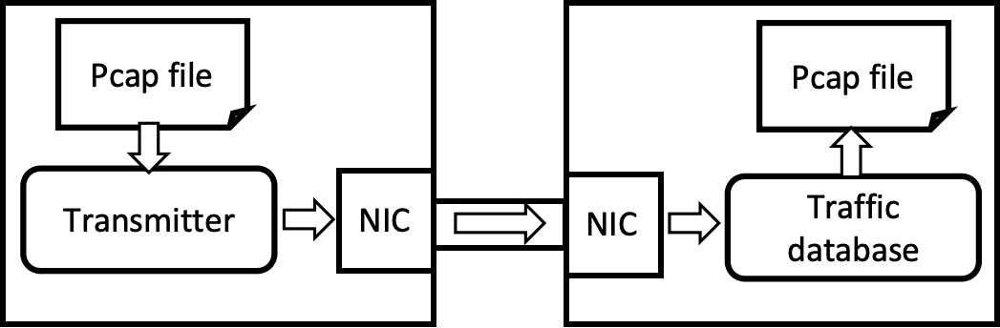

# Traffic database (FilterNET)

## 1.Background
### 1.1.Goals
* Real time capture of high-speed traffic
* High parallelism index construction

### 1.2.Technology Dependencies
* OS: Ubuntu 20.04.1, Linux kernel 5.15.0-139-generic
* Programming Language: C++, version 17
* DPDK, version 21.11.6

## 2.Environmental establishment
### 2.1.Dependencies library install
* We provide the script for dependency installation `shell/depencdency_install.sh` 
	* `sudo` is needed
* You can also manually install dependencies as follows
	* libpcap-dev: `apt install libpcap-dev`
	* build-essential: `apt install build-essential`
	* meson: `apt install meson`
	* python3-pyelftools: `apt install python3-pyelftools`
	* pkg-config: `apt install pkg-config`

### 2.2.DPDK install (Reference: [https://doc.dpdk.org/guides/linux_gsg/index.html](https://doc.dpdk.org/guides/linux_gsg/index.html))
* We provide DPDK installation package and the script `shell/depencdency_install.sh`
	* This script needs to be run in the `shell` folder
	* `sudo` is needed
* You can also download and install DPDK as follows
	* Download DPDK (version 21.11.6) from [https://core.dpdk.org/download/](https://core.dpdk.org/download/)
	* Compile & build DPDK as following code:

```
tar xJf dpdk-<version>.tar.xz
cd dpdk-<version>
meson build
cd build
ninja
(sudo) meson install
(sudo) ldconfig
```

### 2.3.NIC bind

* The network card used to capture data packets needs to be bound to DPDK according to the following steps(Reference: [https://doc.dpdk.org/guides/linux_gsg/linux_drivers.html](https://doc.dpdk.org/guides/linux_gsg/linux_drivers.html))
* We provide the binding script `shell/dpdk_bind.sh`
	* It should be running with NIC name as the input param, such as `./dpdk_bind.sh ens5f1`
	* This script needs to be run in the `shell` folder
	* `sudo` is needed
	* !!! Warning: once the NIC is bound to DPDK, all its packets will not be received by the kernel protocol stack and applications. So do not bind any NICs currently being used by applications other than this project to the DPDK. Specifically, if you are using remote connection tools such as SSH, binding the NIC used for connection to DPDK will cause the connection to disconnect!
* You can aslo bind NIC manually as the following code:

```
cd dpdk-<version>
# Default <version> is 21.11.6

# To see the status of all network ports on the system
./usertools/dpdk-devbind.py --status
# The output should be like this
# Network devices using kernel driver
# ===================================
# 0000:86:00.1 'Ethernet Controller XL710 for 40GbE QSFP+ 1583' if=ens5f1 drv=i40e unused=vfio-pci *Active*
# ...


# <NIC> is the NIC that needs to receive traffic, e.g.
./usertools/dpdk-devbind.py --bind=vfio-pci <NIC>
# LIKE: ./usertools/dpdk-devbind.py --bind=vfio-pci ens5f1
# OR: ./usertools/dpdk-devbind.py --bind=vfio-pci 0000:86:00.1
# If you need to unbind NIC from DPDK: ./usertools/dpdk-devbind.py -u 0000:86:00.1
```

### 2.4.System build
* Create necessary folders (You can also run the script `shell/make_dir.sh` under `shell` folder)

```
mkdir build
```

* Make project

```
make
```

### 2.5.Transmitter build
* The transmitter needs to set on another server. You can use TCPReplay (low speed) or Pktgen-DPDK (high speed) as the packet generator for replaying pcap files.
* The network card used by the transmitter should be directly connected to the network card bound to the DPDK of this system (using Ethernet cable or virtual bridge), as shown in the following figure.



* TCPreplay
	* Install by `apt install tcpreplay`
* Pktgen-DPDK
	* Install DPDK (as 2.2)
	* DPDK NIC bind (as 2.3)
	* Build Pktgen-DPDK as following code:

```
git clone https://github.com/pktgen/Pktgen-DPDK.git
# We also provide the zip of pktgen-DPDK as pktgen-dpdk-pktgen-22.04.1.tar

cd Pktgen-DPDK
make
```

## 3.Run
### 3.1.Run transmitter
* TCPreplay
	* `(sudo) tcpreplay -i <NIC> -t -K -l <Replay_Times> <PCAP_File>`
* Pktgen-DPDK (running in folder `Pktgen-DPDK`)
	* `(sudo) ./Builddir/app/pktgen -l <Cores> -n <Channel_Count> -- -P -m "[<TxCore>:<RxCore>].<PortID>" -s <PortID>:<PCAP_File>`
	* e.g. `(sudo) ./Builddir/app/pktgen -l 12-20 -n 8 -- -P -m "[18:20].0" -s 0:../filled1M_wide10Mp.pcap`
	* "PortID" is the serial number of the bound network card, which can be used `./usertools/dpdk-devbind.py --status` in folder `dpdk-21.11.6` to view.
	* (In Pktgen-DPDK CLI) `start 0`.

### 3.2.Run system

```
(sudo) ./build/dpdkControllerTest
```

### 3.3.Parameter Description
* Users can input parameters to set:
	* disk name and offset for data and index storage (bare disk is recommanded)
	* whether binding to cores (If there are no performance requirements, there is no need to bind cores)
	* the number of DPDK packet capture threads (also the number of packet processing threads)
	* the number of index constructing threads
	* the number of index persisting threads
	* the number of dumper thread group (6 thread for a group)
	* the cores to bind (if needed)
* Example 1 (without binding cores, 4 DPDK packet capture threads, 2 index constructing threads, 1 index persisting thread and 1 dumper thread group)

```
Enter the disk file name of data:
/dev/sdb
Enter the disk offset of data:
0
Enter the disk file name of index:
/dev/sdb
Enter the disk offset of index:
1099511627776
Do you want to bind to cores? (y/n)
n
Enter number of DPDK packet capture threads
4
Enter number of index constructing thread
2
Enter number of index persisting thread
1
Enter number of dumper thread group (1 group has 6 threads)
1
...
[Press any key to quit]
```
* Example 2 (with binding cores, note that the core 0 is remained for DPDK TX thread)

```
Enter the disk file name of data:
/dev/sdb
Enter the disk offset of data:
0
Enter the disk file name of index:
/dev/sdb
Enter the disk offset of index:
1099511627776
Do you want to bind to cores? (y/n)
y
Enter the controller core number (0 is remained)
2
Enter number of DPDK packet capture threads
4
Enter the core number for each packet processing threads (0 is remained)
4 6 8 10
Enter number of index constructing thread
2
Enter the core number for each index constructing threads (0 is remained)
20 22
Enter number of index persisting thread
1
Enter the core number for each index persisting threads (0 is remained)
28
Enter number of dumper thread group (1 group has 6 threads)
1
Enter the core number for dumper thread group0(6 threads total, 0 is remained)
32 34 36 38 40 42
...
[Press any key to stop]
[query]
```

## 3.4.Query
* Query now begin when capture threads stop, support keywords below

| Keyword | Example |
| --- | --- |
| srcip | srcip == 1.77.48.70 |
| dstip | dstip == 1.77.48.0/24 |
| srcport | srcport == 8000 |
| dstport | dstport == 22 |
| srcipv6 | srcipv6 == 2001:0db8:85a3::/64 |
| dstipv6 | dstipv6 == fe80::1a2b:3c4d:5e6f:1 |

* P.S.
	* IPv6 query parsing and IP prefix query parsing are not finished yet, not supported temporarily
	* Time parsing is not supported temporarily
* A query demo as follows:

```
...
[Press any key to stop]
Querier log: query begin, enter your request below (q for QUIT).
srcip == 1.77.48.70
...
1.77.48.70:6870->133.199.130.231:8443
Querier log: query done, find 0 packets with 26658 us.
q
Querier log: query end.
```


## 4.Results Display
* Use the packet sending tool to send packets to the DPDK bound NIC.
* The data files can be checked by `readpcap.py`
	* running `readpcap.py` as `python3 readpcap.py [Disk_Name] [Disk_Offset] [Displayed_Packet_Count_For_Each_File]`
	* such as `python3 readpcap.py /dev/sdb 0 10`
	* the output should be like:

```
read pcap file: /dev/sdb
133.218.212.225:0 --> 177.125.250.149:0 (17)
133.218.212.225:389 --> 177.170.12.250:41405 (17)
193.232.251.75:5075 --> 202.9.126.182:5060 (17)
58.206.72.244:18462 --> 133.10.254.145:6379 (6)
203.194.180.154:123 --> 54.95.226.190:123 (17)
45.238.63.216:50618 --> 163.189.249.185:123 (6)
185.6.43.253:5771 --> 133.199.122.59:176 (6)
133.218.212.225:389 --> 187.207.15.133:2224 (17)
133.218.212.225:389 --> 187.160.208.50:16540 (17)
```

## 5.The structure of codes
* **dpdk_lib**: the manually written dependency libraries required for the project, including indexed data structures, lock free read-write ring structures, etc
* **dpdk_component**: the main code of project components
* **experiment**: some codes for experiment
* **shell**: scripts for environmental setup
* **test**: test code, includes:
	* dpdkControllerTest.cpp: main file of the program